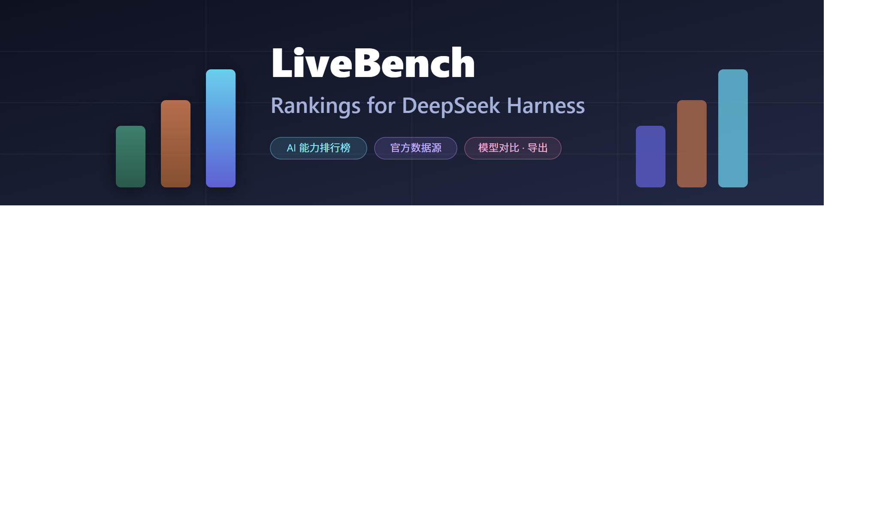

<p align="center">
  
</p>

# LiveBench Rankings for DeepSeek Harness

独立的 AI 能力排行榜插件。通过 Harness 输入框左下角的「AI 排行」入口打开。

## 功能

- 从 https://livebench.ai/ 识别当前前端发布的最新榜单版本，再读取官方 CSV 和分类 JSON。
- 默认每 60 秒检查一次，支持手动刷新。不是网站推送：官网/CDN 尚未发布的数据无法提前获取。
- 同步时间和榜单版本分别显示；网络失败时明确提示缓存，不会伪造或填充评分。
- 支持机构、开放权重、推理模型筛选，模型搜索、分项排序、全部变体、微调模型。
- 默认每个模型家族保留综合得分最高的变体，最多对比 4 个模型；可查看任务级评分与导出 CSV。

## 安装

已构建的发行包没有运行时 npm 依赖。Node.js >= 20.18.1；Windows 使用系统 curl.exe 访问 HTTPS 并校验证书。

在源码工作区运行：

```powershell
powershell -ExecutionPolicy Bypass -File .\scripts\install.ps1 -HarnessHome 'G:\deepseek harness'
```

脚本只向 `plugins/dsh-livebench-rankings` 新增文件，再用官方 `dsh plugin --profile web add link:...` 注册。
已有同名安装会中止，不覆盖；注册前备份 profile 的 package.json、锁文件和补丁文件。
安装后刷新 Harness 页面；如果客户端入口尚未加载，正常退出并重新打开 Harness。安装脚本不会结束进程或中断对话。

卸载（以本机实际 CLI 为准）：

```powershell
$env:DSH_HOME = 'G:\deepseek harness'
dsh plugin --profile web remove dsh-livebench-rankings
```

## 隔离与安全

- 唯一包名、Cordis 行 ID、客户端模块和插槽 ID：`dsh-livebench-rankings`。
- 唯一路由前缀：`/dsh-livebench-rankings`。不注册全局模型工具、不修改系统提示词、不监听会话内容。
- 原生 dialog 内嵌同源独立 iframe，排行榜 CSS 不进入宿主页面，现有皮肤 CSS 也不会进入榜单。
- 不修改全局 fetch、TLS、代理、路由或 localStorage。不读凭据、账号数据和聊天记录。
- 只从 livebench.ai 下载页面和数据，不执行远程 JavaScript。使用 Acorn 读取静态字面量，Papa Parse 解析 CSV。
- 缓存仅位于插件自身的 `.cache/rankings.json`。同一实例并发合并，手动刷新至少相隔 5 秒，所有请求有超时和大小限制。
- 卸载时注销路由、清理周期任务、终止进行中的请求、移除对话框和事件监听。

## 配置

通过 Harness 插件配置编辑器，给本插件独立行设置 `refreshSeconds`（30–3600，默认 60），可选 `proxy`（HTTP/SOCKS 代理 URL 或 `direct`）。不需要修改其他插件。

## 数据口径

总分是每个能力类别平均分的等权平均，保留两位小数；类别内忽略缺失任务而不是当作零。某个类别完全缺失的模型不进入总榜，与当前官网一致。模型名称、机构、开放权重、推理标记和变体来自官方脚本元数据；历史 Grok-3 特例与官网保持一致。未知模型元数据不猜测。只展示当前官方版本，不将不同版本的分数混为排名变化。

官方前端结构改变时，解析器会报错并保留之前的有效缓存，需要更新适配器。

## 开发与验证

```powershell
npm ci
npm run build
npm test
npm run verify:live
npm run dev
```

预览地址：http://127.0.0.1:4317/dsh-livebench-rankings/ 。生产插件复用 Harness 的服务器，不占用额外端口。
